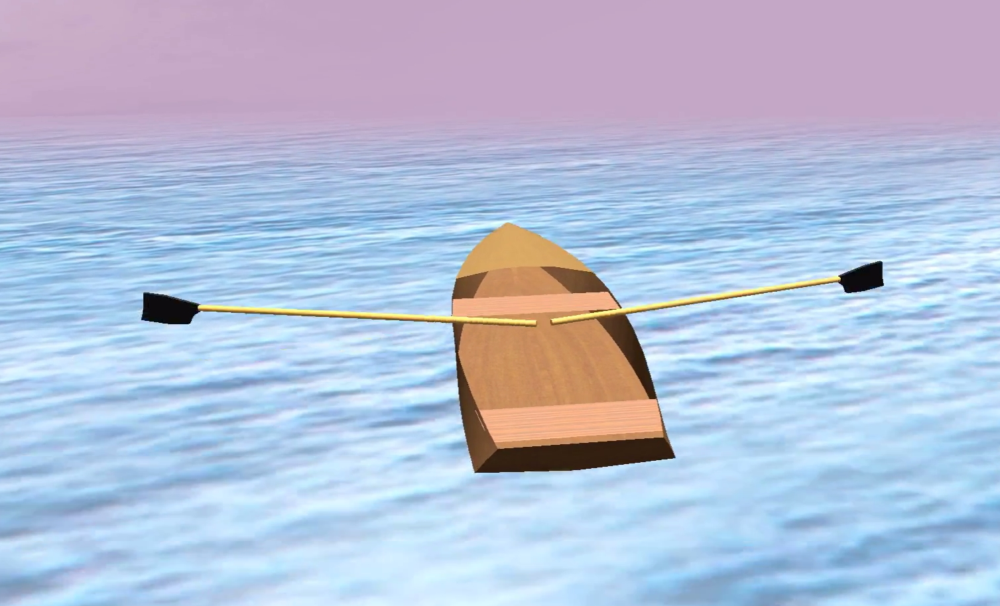

Rowing webgl pots
==========================

1. Clone the repo
2. Load arduino/sketch/sketch.ino in your Arduino
3. put 2 pots in your rowing machine, connect them to arduino
4. ´npm install´ to get the needed modules
5. ´node app.js´
6. Go to http://localhost:3000/ on your browser and row

